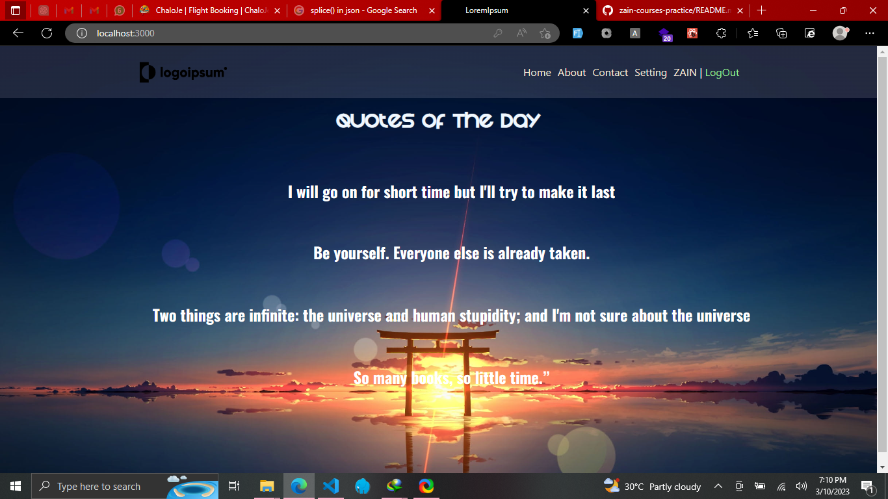
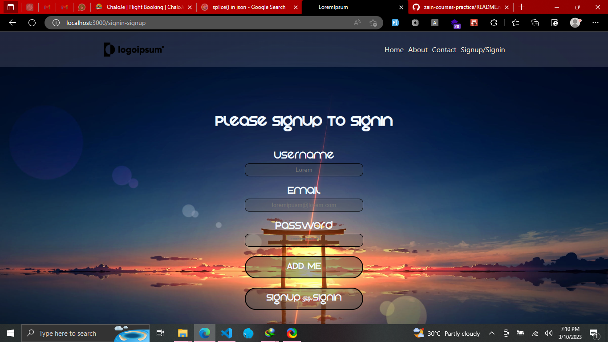
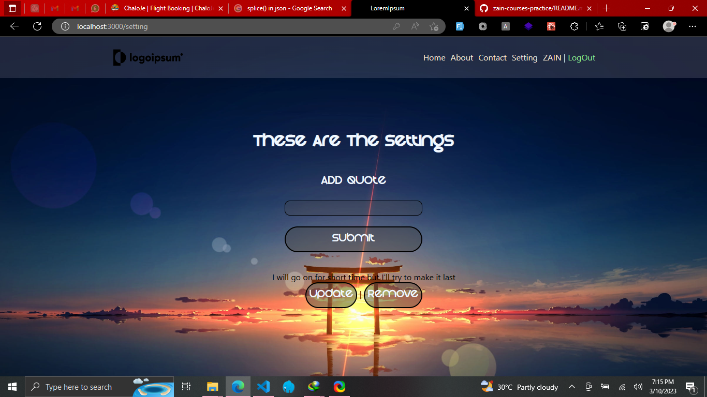

# Getting Started with Create React App

# PrivateRouting in React 🚀

This web app is built using React and utilizes contextAPI and React Private Routing. The app allows users to access private routes only after authentication.

## SreenShots 📹

## Demo Videos 🎥

### Main Video 📹

Watch a demo of the app's main features by clicking the link below:

### Add-Me Video 📹

Check out a video showcasing the app's 'add me' feature:

## Technologies Used 🛠️

- React
- ContextAPI
- React Private Routing

## Installation 🚀

To install this app on your local machine, follow these steps:

1. Clone this repository.
2. Navigate to the project directory.
3. Install the necessary dependencies by running the command `npm install`.
4. Start the app by running the command `npm start`.

## Acknowledgements 👏

Thank you to the following resources for their help in building this app:

- React documentation
- ContextAPI documentation
- React Private Routing documentation

## Contributing 🤝

Contributions are welcome! Please feel free to submit a pull request or open an issue if you encounter any bugs or have suggestions for new features.

## License 📜

This project is licensed under the MIT License - see the LICENSE.md file for details.
